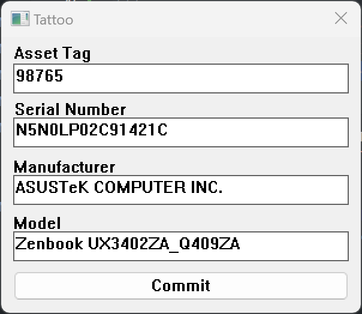

# Tattoo

Tattoo is a program designed to automatically collect device information on run, and insert it into the registry of the device. This information is intended for archival purposes and will remain there for later inspection. Some of the bennifits of storing information in the registry is that it provides a static and proctected way to maintain information like,

- The day the computer was deployed.
- The task sequence used when you deployed the computer.
- The asset tag assigned.
- The device name when deployed.
- The serial number of the device.
- The device model.
- The device make.


## Requirements

- Windows >=10, or Windows Server 2016.
- PowerShell 5.1 or later

## Running

In order to run tattoo.exe you will need at a minimum, the following file along side the executable.

tatto.exe.manifest
```xml
<?xml version="1.0" encoding="UTF-8" standalone="yes"?>
<assembly xmlns="urn:schemas-microsoft-com:asm.v1" manifestVersion="1.0">
<assemblyIdentity
    version="1.0.0.0"
    processorArchitecture="*"
    name="app"
    type="win32"
/>
<dependency>
    <dependentAssembly>
        <assemblyIdentity
            type="win32"
            name="Microsoft.Windows.Common-Controls"
            version="6.0.0.0"
            processorArchitecture="*"
            publicKeyToken="6595b64144ccf1df"
            language="*"
        />
    </dependentAssembly>
</dependency>
</assembly>
```

Otherwise it will throw an error `exit code: 0xc0000139, STATUS_ENTRYPOINT_NOT_FOUND` when trying to run the program. This is a bug with the native windows gui API that has not been resolved.

## Example Screenshots


